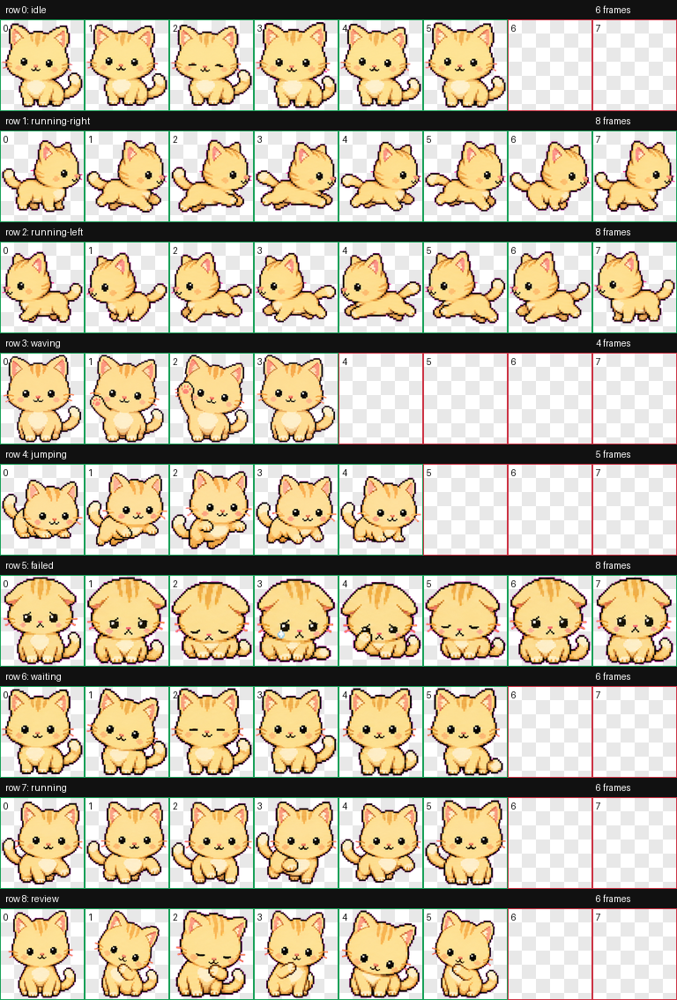
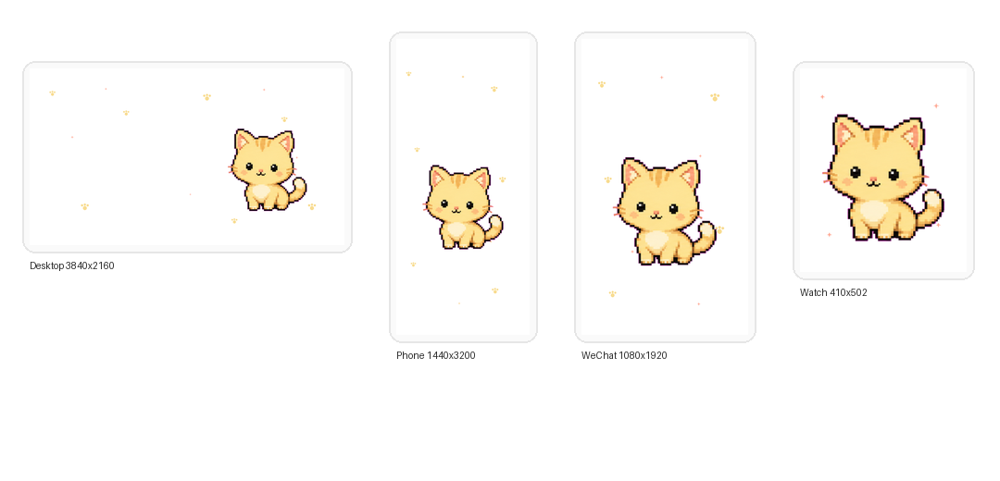

# Mimi Pixel Cat

这是一份从一次 Codex 对话中整理出来的独立归档包，只包含本次对话里产生的 Mimi 小猫相关内容，不包含原项目目录里的其他代码。

Mimi 是一只完整身体的奶油金色动漫像素小猫。最终产物包括：

- Codex pet 包：`assets/pet/pet.json` 和 `assets/pet/spritesheet.webp`
- 动画行源图：`assets/animation-rows/`
- QA 与验证文件：`assets/qa/`
- 白底壁纸：电脑、手机、手表、微信背景，见 `assets/wallpapers/`
- 设计过程与 prompt：`design-notes/`
- 白底壁纸生成脚本：`scripts/make_wallpapers.py`

## Preview

## Main Files

| Path | Purpose |
| --- | --- |
| `assets/pet/spritesheet.webp` | Codex pet 使用的最终透明 spritesheet |
| `assets/pet/pet.json` | Codex pet manifest |
| `assets/qa/contact-sheet.png` | 所有动画状态的总览 |
| `assets/qa/validation.json` | atlas 尺寸、透明度和帧校验 |
| `assets/animation-rows/*.png` | base 与各动画行的原始生成结果 |
| `assets/wallpapers/*.png` | 白底壁纸导出 |
| `design-notes/*.html` | 对话里用浏览器确认过的设计方向页面 |
| `design-notes/base-prompt.md` | 基础小猫生成 prompt |
| `design-notes/row-prompts/` | 各动画行 prompt |

## Outcome

最终验证通过：

- `validation.json`: no errors, no warnings
- `review.json`: no errors, no warnings
- spritesheet: `1536x1872`, `RGBA`
- cell size: `192x208`
- animation states: `idle`, `running-right`, `running-left`, `waving`, `jumping`, `failed`, `waiting`, `running`, `review`

`running-left` 是从 `running-right` 镜像派生，因为 Mimi 没有文字、单侧道具或方向敏感标记。

